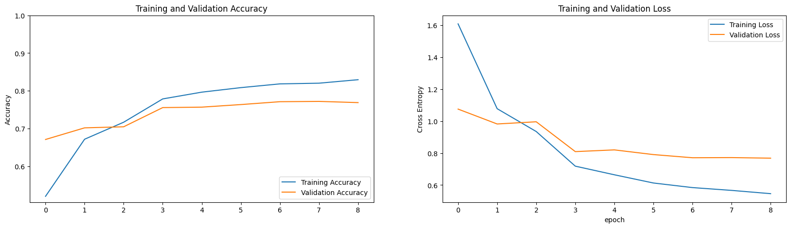
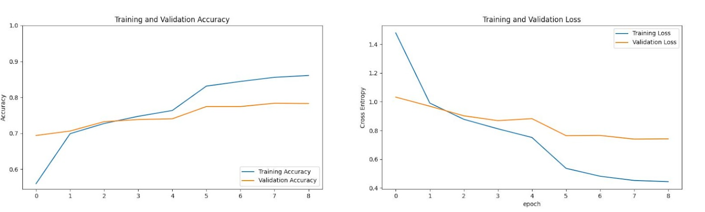
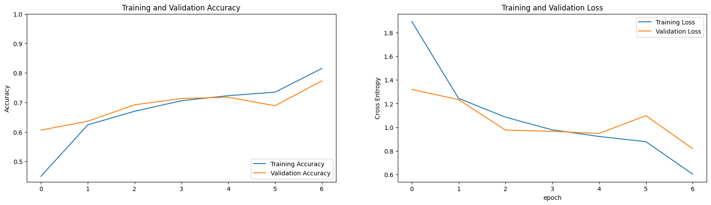
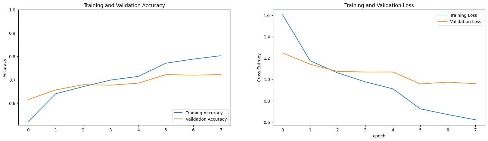
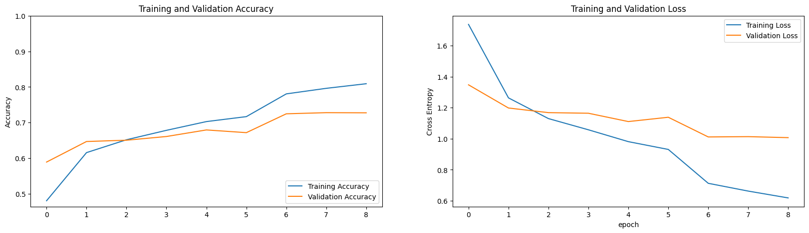
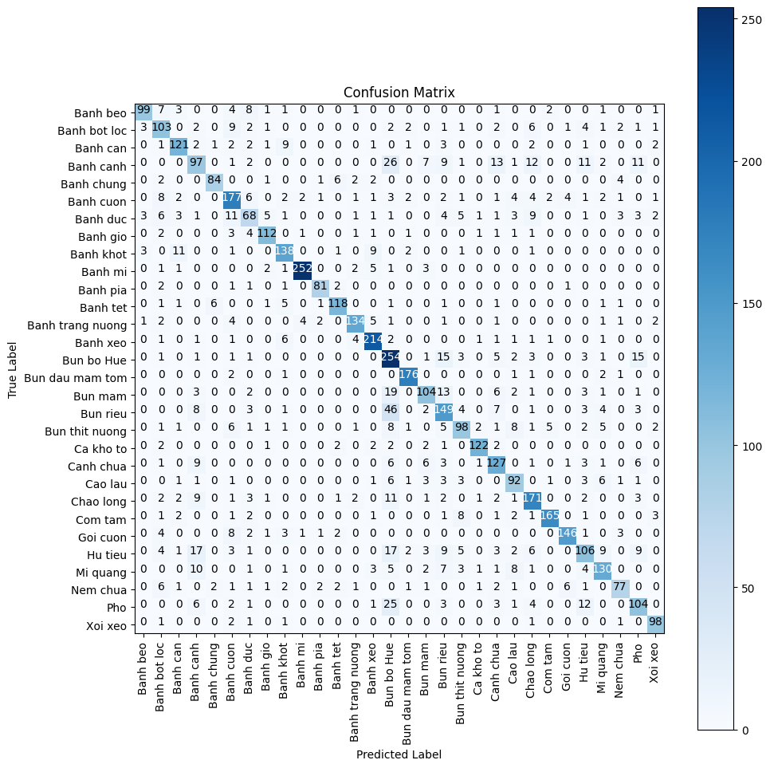
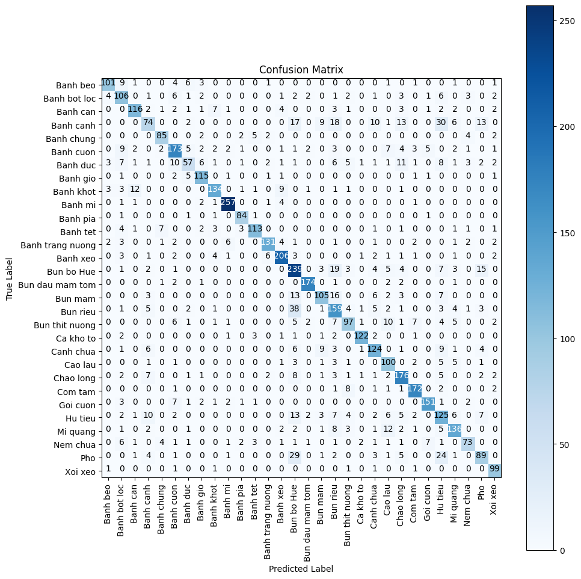

# Dự án phân loại bệnh mắt với AI
- Sử dụng các mô hình AI để thực huấn luyện phân loại 30 món ăn của Việt Nam
- Tập dữ liệu là các ảnh chụp món ăn với góc nhìn cận cảnh
- Lưu ý
    - Các đường dẫn trong các file .ipynb sẽ khác đối với mọi người
## Mục lục
- [Import](#chuẩn-bị)
- [Dữ liệu](#dữ-liệu)
- [Mô hình](#mô-hình-và-huấn-luyện)
- [Huấn luyện](#huấn-luyện)
- [Kết quả và đánh giá](#kết-quả-và-đánh-giá)
## Chuẩn bị
### Các thư viện cần thiết
- os: hỗ trợ truy xuất dữ liệu trong thư mục
- matplotlib: vẽ và hỗ trợ vẽ biểu đồ đánh giá
- Các thư viện từ scikit-learn(sklearn) và TensorFlow: Hỗ trợ xây dựng các lớp trong mô hình, các hàm tối ưu, mất mát, tiền xử lý ảnh có sẵn, hỗ trợ ổn định mô hình(regularizers)
### Các kịch bản
- Các mô hình sử dụng:
    - DenseNet201
    - Xception
- Các thành phần thay đổi
    - Hàm tối ưu: Adam và RMS
    - Hàm kích hoạt: Relu và LeakyRelu
    - Lớp pooling cuối cùng: MaxPooling và GlobalAveragePooling
## Dữ liệu
### Mô tả
- Bộ dữ liệu bao gồm 30 nhãn phân loại của các món ăn khác nhau của Việt Nam tổng có 25136 ảnh. 
- URL của Bộ dữ liệu: [30VNFoods](https://www.kaggle.com/datasets/quandang/vietnamese-foods)
### Chia dữ liệu
- Bộ dữ liệu đã được chia theo train/val/test
## Mô hình và huấn luyện
### Các mô hình
- Các mô hình được sử dụng
    - DenseNet201 với
        - Adam, leakyReLU, GlobalAveragePooling
        - Adam, ReLU, GlobalAveragePooling
        - RMS, leakyReLU, GlobalAveragePooling
    - Xception
        - Adam, leakyReLU, GlobalAveragePooling
        - Adam, ReLU, GlobalAveragePooling
        - RMS, leakyReLU, GlobalAveragePooling 
### Huấn luyện
- Các tham số huấn luyện khác
    - Hàm mất mát: categorical_crossentropy
    - Batch size: 64
    - Epoch tối đa: 9
    - Đợi: 
        - Tối đa 1 epoch đối với việc thay đổi learning rate sau khi mô hình không cải thiện 
        - tối đa 2 epoch đối vội dừng huấn luyện sau khi mô hình không cải thiện dù đã tác động vào learning rate

## Kết quả và đánh giá
- Kết quả huấn luyện:
    - DenseNet201 với
        - Adam, leakyReLU, GlobalAveragePooling
        
        - Adam, ReLU, GlobalAveragePooling
        
        - RMS, leakyReLU, GlobalAveragePooling
        
    - Xception
        - Adam, leakyReLU, GlobalAveragePooling
        
        - Adam, ReLU, GlobalAveragePooling
        
        - RMS, leakyReLU, GlobalAveragePooling 
        
- Ma trận nhầm lẫn:
    - DenseNet201 với
        - Adam, leakyReLU, GlobalAveragePooling
        
        - Adam, ReLU, GlobalAveragePooling
        
        - RMS, leakyReLU, GlobalAveragePooling
        
    - Xception
        - Adam, leakyReLU, GlobalAveragePooling
        
        - Adam, ReLU, GlobalAveragePooling
        
        - RMS, leakyReLU, GlobalAveragePooling 
        

    